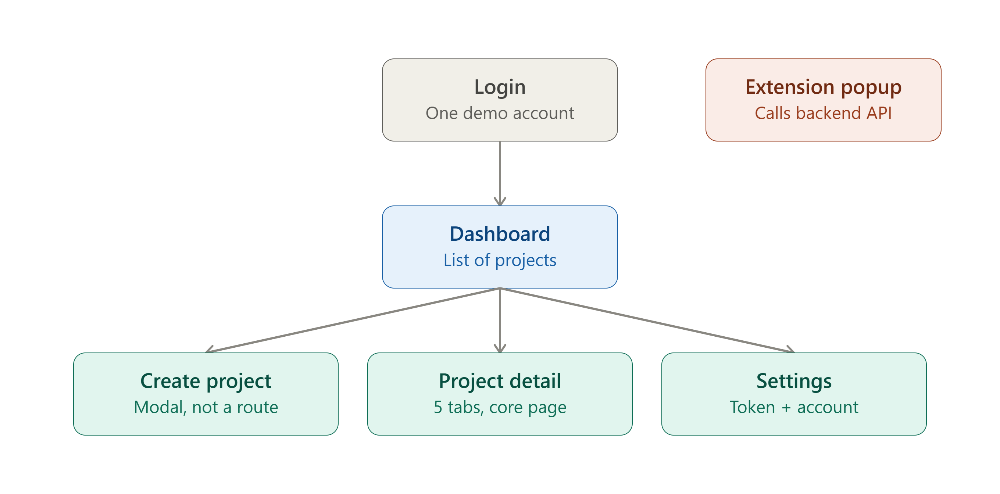
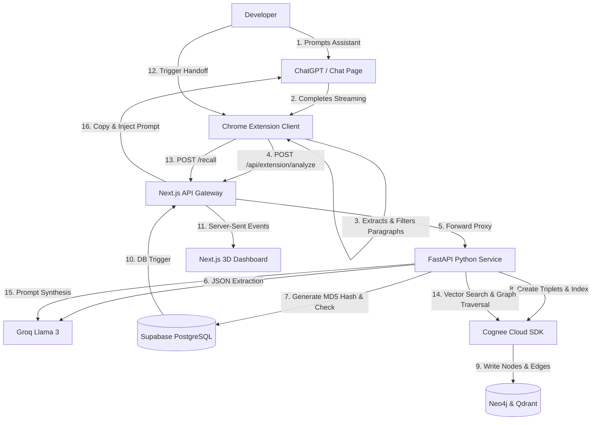

# ContextOS 🧠

<div align="center">

<h3>The Ambient, Cross-Platform Knowledge Graph Memory Layer for AI-Assisted Development</h3>

<p>
  <strong>ContextOS</strong> is a roaming memory client and graph orchestrator that meet developers exactly where they work. It ambiently captures structural decisions, tasks, and architectural insights from your AI conversations, constructs an evolving 3D Knowledge Graph, and lets you inject your consolidated project state into any target assistant with a single click.
</p>

[](https://nextjs.org/)
[](https://fastapi.tiangolo.com/)
[](https://developer.chrome.com/docs/extensions/)
[](https://www.cognee.ai/)

---

<p align="center">
  <a href="#-the-story">The Story</a> •
  <a href="#-why-contextos">Why ContextOS?</a> •
  <a href="#-how-it-works">How It Works</a> •
  <a href="#-the-architecture">Architecture</a> •
  <a href="#-core-features">Features</a> •
  <a href="#-quick-start">Quick Start</a>
</p>

</div>

---

## 📸 The System in Action

<div align="center">
  <h3>1. Ambient 3D Spatial Knowledge Graph Dashboard</h3>
  <p>A live glassmorphic visualizer depicting decisions, facts, and tasks as structured, clustered nodes linked via physical edges (Neo4j + Three.js + SSE).</p>
  
</div>

<br />

<div align="center">
  <h3>2. Proactive In-Chat Capture Overlay</h3>
  <p>The Chrome extension listens to ChatGPT stream completion, cleans code/diagrams, and slides in a sleek horizontal toolbar below target paragraphs for instant save.</p>
  <!-- Placeholder Image for Extension capture overlay -->
  
</div>

---

## 📖 The Story

### The Dilemma: Fragile AI Context
Developers spend hours brainstorming system designs and refactoring code with AI assistants. But the moment you open a new chat session, **your context is dead**. You have to painstakingly write long background summaries or paste code blocks to bring the AI back to speed. Even worse, your project knowledge is siloed—decisions made in ChatGPT are completely invisible to Cursor or Claude.

### The Solution: An Ambient Memory Layer
ContextOS introduces a roaming background client that monitors your active sessions. When the AI outputs a critical architectural decision, the extension detects it, analyzes it using Groq in the background, and prompts you with a non-intrusive suggested toolbar.

Saving a memory parses it into semantic triplets, embedding it inside a persistent **Knowledge Graph** managed by **Cognee**. When you switch tabs or open a new chat, you can recall and inject your entire project state with a single click.

---

## ⚔️ Why ContextOS?

Unlike note-taking tools, bookmarks, or basic vector-only retrieval, ContextOS is built for the dynamic, multi-assistant AI era:

| Feature / System | ContextOS 🧠 | Vector RAG Only | Chat History Search | Browser Bookmarks |
| :--- | :---: | :---: | :---: | :---: |
| **Multi-Platform Sync** | **Yes (Cross-Tab/Client)** | No | No | No |
| **Relational Graph Mapping** | **Yes (Neo4j Triplets)** | No (Text Chunks) | No | No |
| **Proactive Extraction** | **Yes (Ambient DOM)** | No | No | No |
| **Code & Diagram Filtering** | **Yes (Heuristic)** | No | No | No |
| **One-Click Handoff Injection**| **Yes (Textarea DOM)** | No | No | No |
| **Database Deduplication** | **Yes (MD5 Content Hash)**| No | No | No |

---

## 🔄 How It Works



---

## 💎 Core Products

### 💡 Proactive Context Capture
* **What it does**: Ambiently tracks the AI response stream and surfaces key decisions, tasks, and risks below the paragraph where they are mentioned.
* **Why it matters**: Eliminates the overhead of highlighting text or copying snippets manually. It captures data in context, at the exact moment of creation.
* **Technical Highlight**: Employs a zero-dependency, button-state transition listener. Slices the top 3 paragraphs of the completed stream and filters out ASCII diagrams and code blocks using character-density heuristic algorithms before parallel analysis.

### 🕸️ Cognee Knowledge Graph
* **What it does**: Parses raw text memories into structured entities and semantic relationships (e.g. `[FastAPI] -> (REPLACES) -> [Flask]`).
* **Why it matters**: Traditional vector RAG suffers from semantic fragmentation. A Knowledge Graph tracks dependencies and relationship directions, allowing the AI to recall project states with zero context drift.
* **Technical Highlight**: FastAPI backend coordinates MD5 content hash checks against Supabase. New hashes bypass expensive Groq calls and directly ingest triplets to Cognee, keeping vector and graph indexes clean.

### 🛸 Universal Handoff Injection
* **What it does**: Summarizes your project graph into a cohesive Markdown continuation prompt and automatically injects it into your chat composer window.
* **Why it matters**: Allows you to pick up exactly where you left off, even when moving from a brainstorming chat in ChatGPT to code refactoring in Cursor or Claude.
* **Technical Highlight**: Performs a semantic-vector search coupled with a depth-first graph traversal inside Neo4j, using Groq to synthesize nodes, tasks, and risks into a perfectly formatted assistant prompt.

---

## ⚡ Quick Start

### Prerequisites
- Python `3.10+`
- Node.js `18+`
- Chrome Browser

### 1. Environment Setup
Create a `.env` file in the root directory:
```env
NEXT_PUBLIC_SUPABASE_URL=your_supabase_url
NEXT_PUBLIC_SUPABASE_ANON_KEY=your_anon_key
SUPABASE_SERVICE_ROLE_KEY=your_service_role_key

COGNEE_CLOUD_URL=your_cognee_url
COGNEE_API_KEY=your_cognee_api_key

GROQ_API_KEY=your_groq_api_key
PYTHON_SERVICE_URL=http://localhost:8000
```

### 2. Startup Commands

<details>
<summary><b>Step A: Next.js Frontend & Gateway</b></summary>

```bash
# Run from repository root
npm install
npm run dev
```
*Serves the 3D dashboard on `http://localhost:3000`*
</details>

<details>
<summary><b>Step B: Python FastAPI Orchestrator</b></summary>

```bash
cd python-cognee-service
python -m venv venv

# Windows Activation:
.\venv\Scripts\activate
# Mac/Linux Activation:
source venv/bin/activate

# Install and Run
pip install -r requirements.txt
uvicorn main:app --port 8000
```
*Serves the backend endpoints on `http://localhost:8000`*
</details>

<details>
<summary><b>Step C: Chrome Extension Client</b></summary>

1. Navigate browser to `chrome://extensions/`.
2. Toggle **Developer mode** in the top-right corner.
3. Click **Load unpacked** in the top-left corner.
4. Select the `extension/` folder in the root of the project directory.
</details>

---

## 📂 Project Structure

```
ContextOS Root
├── extension/          # Chrome Extension client (background script & overlays)
├── app/                # Next.js pages & proxy API routes
├── frontend/           # Three.js (React Three Fiber) 3D spatial rendering
├── python-service/     # FastAPI service, Groq extraction, and Cognee SDK bindings
└── docs/               # Detailed architectural specs and submission guides
```

---

## 📚 Technical Documentation Index

For deeper specifications, check out the specialized guides in our `docs/` workspace:
* 🏗️ **[Architecture Specification](file:///C:/Users/sohar/Projects/ContextOS/docs/ARCHITECTURE.md)**: Network diagrams, pipeline cycles, and component layouts.
* 📝 **[Technical Documentation](file:///C:/Users/sohar/Projects/ContextOS/docs/TECHNICAL_DOCUMENTATION.md)**: Complete API definitions, payload schemas, and backend details.
* 💡 **[Project Decisions & Justifications](file:///C:/Users/sohar/Projects/ContextOS/docs/PROJECT_DECISIONS.md)**: Deep dive into the architectural trade-offs.
* 🎥 **[Video Demo & Presentation Guide](file:///C:/Users/sohar/Projects/ContextOS/docs/VIDEO_GUIDE.md)**: Timing guidelines, voiceover script, and Possible Judge Questions.
* 🏆 **[Hackathon Submission Guide](file:///C:/Users/sohar/Projects/ContextOS/docs/HACKATHON_SUBMISSION.md)**: Copy-paste ready Devpost forms.

---

## 🗺️ Roadmap
- [ ] **Multi-Assistant Ingestion**: Connect Claude and Gemini.
- [ ] **IDE Integrations**: Launch Cursor and VS Code capture extensions.
- [ ] **Collaborative Graphs**: Share active project graphs across team development logs.

---

## 📜 License
Licensed under the [MIT License](LICENSE).
