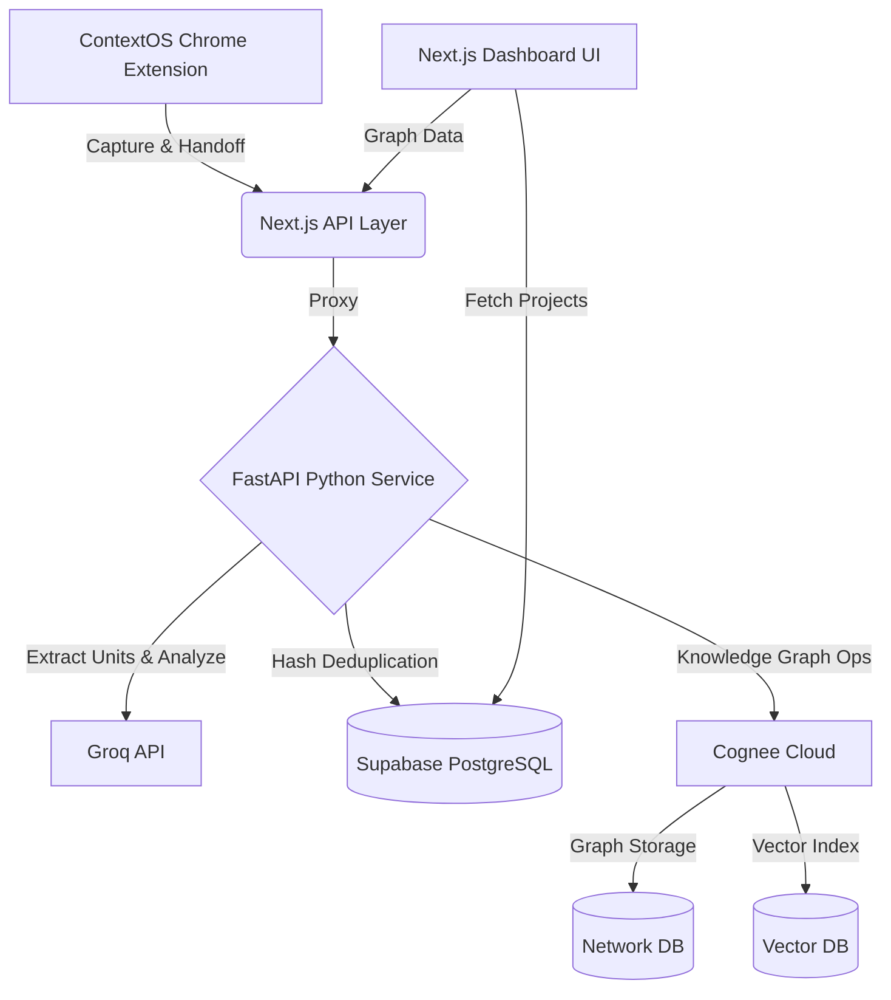
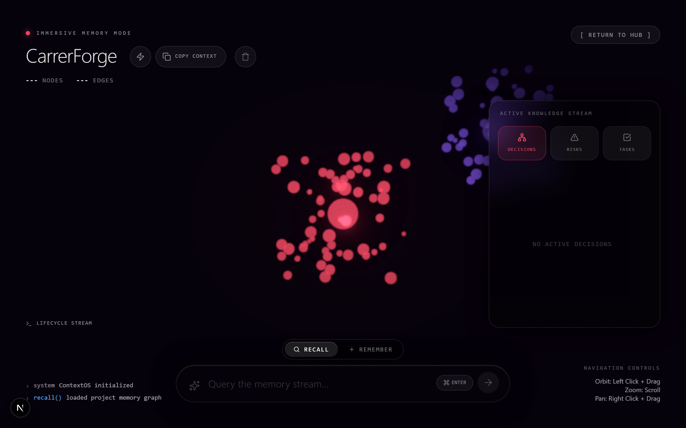
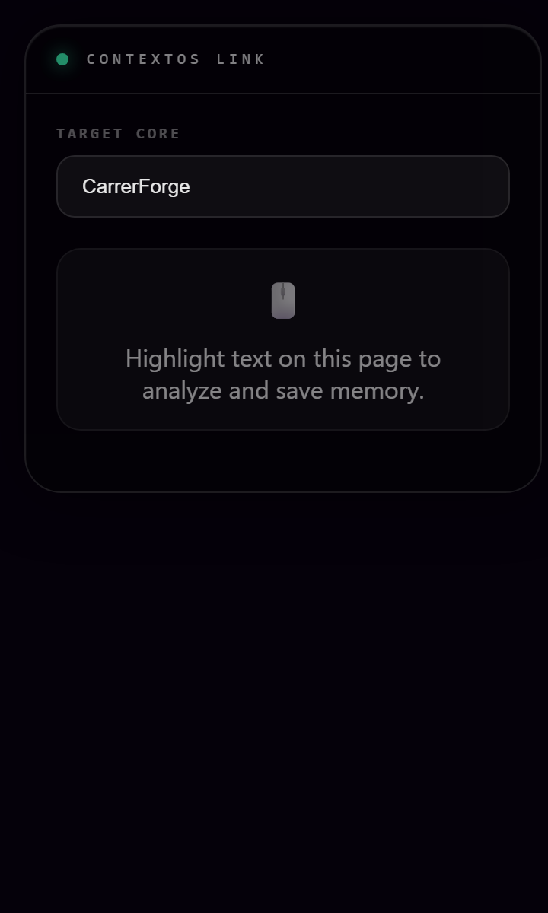
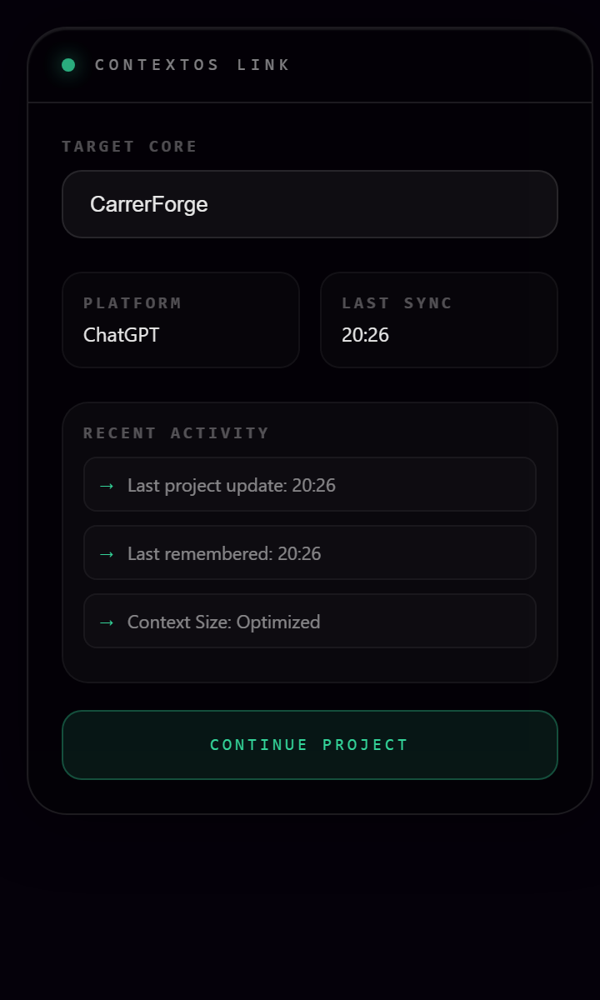

# ContextOS


ContextOS is a proactive, ambient memory layer that transforms how you interact with AI. It acts as an intelligent bridge across platforms—seamlessly tracking your project context, building an evolving knowledge graph, and allowing you to instantly hand off your entire project state to any AI assistant anywhere on the web.

## The Problem

When working on complex projects with AI assistants (like ChatGPT, Claude, or Gemini), context is incredibly fragile. 
- **Context is lost across sessions:** Every time you start a new chat, you have to painstakingly re-explain your architecture, decisions, and goals.
- **Siloed Knowledge:** The brilliant architecture decision you made in Claude yesterday is completely invisible to Cursor today.
- **Manual Overhead:** Maintaining a "master prompt" document is tedious, error-prone, and quickly becomes outdated.

## The Solution

ContextOS solves this by creating a persistent, cross-platform memory layer powered by Cognee's graph capabilities. 

**The Workflow:**
1. **Browser**: As you work across AI platforms, the ContextOS extension quietly observes your interactions.
2. **AI Analysis (Groq)**: Meaningful text blocks are routed to a blazing-fast Groq LLM endpoint to extract discrete project insights (decisions, tasks, risks).
3. **Knowledge Graph (Cognee Cloud)**: These insights are pushed into Cognee, which structures them into a queryable, persistent Knowledge Graph.
4. **Dashboard**: You can visually explore this memory graph and manage your project data in a stunning 3D spatial interface.
5. **Continue Anywhere**: With one click, ContextOS compiles your entire project state into a perfectly formatted continuation prompt and injects it into your target AI platform.

## Features

- **AI Memory Suggestions**: ContextOS proactively analyzes your AI conversations in the background and surfaces a beautiful, non-intrusive floating indicator with memory suggestions. No manual highlighting required!
- **Universal AI Handoff**: Continue your project across ChatGPT, Claude, Gemini, Cursor, GitHub, or Perplexity with a single click.
- **Smart Importance Detection**: Automatically scores text blocks so only highly relevant information makes it to your suggestion queue.
- **Project Knowledge Graph**: A full memory pipeline leveraging graph databases rather than traditional vector RAG.
- **3D Spatial Memory Interface**: A visually stunning, glassmorphic 3D dashboard to explore your project nodes and edges.
- **Project Isolation**: Group your memories into distinct, isolated projects.
- **Continuation Prompt Generator**: Automatically compiles decisions, tasks, facts, and risks into a single master prompt.
- **Complete Memory Lifecycle**: 
  - `remember`: Saves new memories.
  - `recall`: Retrieves structured context.
  - `improve`: Enriches the graph with a new LLM pass.
  - `forget`: Permanently deletes memories or entire projects.
- **Duplicate Detection**: Hashes and dedupes memories at the database layer to prevent graph pollution.
- **Chrome Extension**: The primary interface that acts as your roaming context layer.
- **Decisions, Tasks, & Risks Tracking**: Automatically categorizes extracted insights.
- **Timeline Activity Stream**: A chronological log of how your project has evolved.

## Architecture



**Responsibilities:**
- **Chrome Extension**: Monitors DOM for streaming AI text, handles proactive UI (Shadow DOM), manages handoffs, captures metadata.
- **Next.js (Frontend & API proxy)**: Renders the 3D dashboard, proxies extension requests, manages project CRUD operations in Supabase.
- **Python Service (FastAPI)**: The orchestration engine. Handles deduplication logic, calls Groq, formats statements, and interacts with Cognee.
- **Groq**: Extremely fast extraction of structured JSON (Tasks, Decisions, Risks) from raw text.
- **Cognee Cloud**: Creates, manages, and queries the project knowledge graph.
- **Supabase**: Relational storage for Projects, Extension Tokens, and Deduplication Capture Hashes.

## Tech Stack

**Frontend:** Next.js (React), Tailwind CSS, Three.js (Spatial UI), Lucide Icons  
**Backend:** FastAPI (Python), Next.js App Router API  
**Extension:** Manifest V3, Vanilla JS/CSS (Shadow DOM)  
**Database:** Supabase (PostgreSQL)  
**AI & Graph:** Cognee Cloud, Groq API  

## Memory Lifecycle

ContextOS is built around four core memory operations:

1. **`remember()`**: When you save a memory (e.g. from the extension's suggestion panel), the text is hashed, extracted by Groq, formatted, and ingested into Cognee as a new node.
2. **`recall()`**: When you click "Continue Project", ContextOS queries Cognee to traverse the graph and retrieve the project's current state, decisions, and tasks.
3. **`improve()`**: Triggered by the "Refresh" (Zap) button on the dashboard. Cognee runs a background LLM pass to merge duplicate nodes and enrich graph relationships.
4. **`forget()`**: Triggered when you delete a project. ContextOS instructs Cognee to completely wipe the dataset and graph, and cleans up relational records in Supabase.

## How It Works (The User Journey)

1. **Start a Project**: You open the ContextOS Dashboard and initialize a new project (e.g. "Hackathon Build").
2. **Browse & Work**: You go to Claude and start brainstorming architecture.
3. **Proactive Suggestion**: Claude gives a great answer. The ContextOS extension notices, analyzes it via Groq in the background, and a subtle `🧠 1 Memory Suggestion` pulses in the corner.
4. **Save Context**: You click the indicator, review the extracted Decision, and hit "Save". The memory enters Cognee.
5. **Handoff**: Later, you open Cursor. You open the extension, select your project, and click "Continue Project".
6. **Inject**: The extension generates a master continuation prompt from your graph, copies it to your clipboard, and you paste it into Cursor to pick up exactly where you left off.

## Installation

### 1. Clone the Repository
```bash
git clone https://github.com/your-username/ContextOS.git
cd ContextOS
```

### 2. Run the Next.js Frontend
```bash
npm install
npm run dev
```
*Runs on `http://localhost:3000`*

### 3. Run the Python Service
Open a new terminal:
```bash
cd python-cognee-service
python -m venv venv
# Windows:
.\venv\Scripts\activate
# Mac/Linux:
source venv/bin/activate

pip install -r requirements.txt
uvicorn main:app --port 8000
```

### 4. Load the Chrome Extension
1. Open Chrome and go to `chrome://extensions/`
2. Enable **Developer mode** in the top right.
3. Click **Load unpacked**.
4. Select the `extension/` folder inside the ContextOS directory.

## Environment Variables

Create a `.env` file in the root directory:

```env
# SUPABASE
NEXT_PUBLIC_SUPABASE_URL=your_supabase_url
NEXT_PUBLIC_SUPABASE_ANON_KEY=your_anon_key
SUPABASE_SERVICE_ROLE_KEY=your_service_role_key

# COGNEE CLOUD
COGNEE_CLOUD_URL=your_cognee_url
COGNEE_API_KEY=your_cognee_api_key

# LLM
GROQ_API_KEY=your_groq_api_key

# INTERNAL SERVICES
PYTHON_SERVICE_URL=http://localhost:8000
```

## Screenshots

> 
> 
> 

## Why Cognee?

ContextOS explicitly avoids traditional Vector Database RAG (Retrieval-Augmented Generation) in favor of **Cognee's Knowledge Graphs**.

- **Reasoning Chains vs Semantic Similarity**: Vector RAG is great at finding "similar" text, but terrible at understanding logical progression. Cognee's graph structure allows ContextOS to trace *how* a decision was made and *what* alternatives were rejected.
- **Persistent Memory Integration**: Cognee allows us to create isolated datasets (`ctxos_project_id`) that act as long-term, self-improving memory banks.
- **Self-Improvement**: By leveraging Cognee's `improve()` pipeline, our knowledge graph actually gets smarter over time, merging conflicting facts and strengthening relationships without manual intervention.

## Demo Flow

For hackathon judges, follow this sequence:
1. Open the 3D Dashboard (`localhost:3000`). Create a new project called "ContextOS Demo".
2. Open `chatgpt.com`. The extension icon will light up.
3. Ask ChatGPT: *"What is the best way to handle auth in Next.js? Give me 3 options and pick one."*
4. Wait for the response. Watch the **`🧠 Memory Suggestion`** indicator appear on the page!
5. Click it, review the extracted architecture decision, and hit **Save**.
6. Open the extension popup. You'll see the "Universal Handoff" UI.
7. Click **Continue Project**. It will generate the prompt and copy it.
8. Click the **Claude** destination button. It will open a new tab to `claude.ai`.
9. Paste the clipboard into Claude and watch it instantly understand the exact auth decision you just made in ChatGPT!

## Future Work
- **Native IDE Integrations**: Bring the suggestion indicator directly into VSCode/Cursor editors.
- **Automated Memory Expiry**: Allow facts to naturally decay if contradicted by newer graph nodes.
- **Multi-Agent Sync**: Allow autonomous AI agents to query the Cognee graph directly via API.

## AI Disclosure
As permitted by the hackathon rules, AI coding assistants (including Anthropic Claude and Google Gemini models) were utilized during the development of this project for architecture brainstorming, boilerplate generation, and debugging assistance. All core architecture and integration logic was explicitly directed and verified by the human developer.
