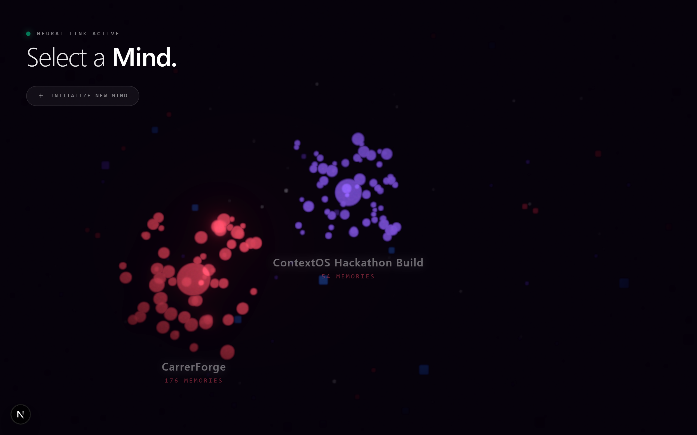

# ContextOS 🧠

[](https://nextjs.org/)
[](https://fastapi.tiangolo.com/)
[](https://developer.chrome.com/docs/extensions/)
[](https://www.cognee.ai/)

**ContextOS** is a proactive, ambient memory layer that transforms how you build software with AI. It acts as an intelligent bridge across platforms—seamlessly tracking your project context, building an evolving knowledge graph, and allowing you to instantly hand off your entire project state to any AI assistant anywhere on the web.

---

## 📖 Complete Documentation Index

To explore the architecture, decisions, and walkthroughs, check out the streamlined guides inside the `docs/` folder:

* 🏗️ **[Architecture Specification](file:///C:/Users/sohar/Projects/ContextOS/docs/ARCHITECTURE.md)**: High-level systems design and sequence flow diagrams.
* 📝 **[Technical Documentation](file:///C:/Users/sohar/Projects/ContextOS/docs/TECHNICAL_DOCUMENTATION.md)**: Walkthrough of the folder structures, API endpoints, and memory pipeline lifecycle.
* 💡 **[Project Decisions & Justifications](file:///C:/Users/sohar/Projects/ContextOS/docs/PROJECT_DECISIONS.md)**: The "Why" behind FastAPI vs. Flask, Cognee vs. Vector RAG, and Extension vs. Web Apps.
* 🎥 **[Video Demo & Presentation Guide](file:///C:/Users/sohar/Projects/ContextOS/docs/VIDEO_GUIDE.md)**: Word-for-word recording script, pre-demo checklists, and technical Judge Q&As.
* 🏆 **[Hackathon Submission Guide](file:///C:/Users/sohar/Projects/ContextOS/docs/HACKATHON_SUBMISSION.md)**: Copy-paste ready Devpost forms, innovation summaries, and lessons learned.

---

## ⚡ Quick Start

### 1. Run the Next.js Web Dashboard
```bash
# Install dependencies
npm install

# Run the development server
npm run dev
```
*Dashboard running on `http://localhost:3000`*

### 2. Run the Python FastAPI Backend
Open a new terminal:
```bash
cd python-cognee-service
python -m venv venv

# Activate Virtual Environment (Windows)
.\venv\Scripts\activate
# Activate Virtual Environment (Mac/Linux)
source venv/bin/activate

# Install dependencies and start server
pip install -r requirements.txt
uvicorn main:app --port 8000
```
*Backend running on `http://localhost:8000`*

### 3. Load the Chrome Extension
1. Open Chrome and navigate to `chrome://extensions/`.
2. Toggle **Developer mode** on in the top-right corner.
3. Click **Load unpacked** in the top-left corner.
4. Select the `extension/` folder inside the ContextOS directory.

---

## 🛠️ Tech Stack

- **Dashboard**: Next.js 16 (React), Tailwind CSS, Three.js (React Three Fiber)
- **Backend Service**: Python 3.11, FastAPI, Pydantic v2
- **Extension**: Chrome Manifest V3, Vanilla JS/CSS (Shadow DOM isolated overlays)
- **Database & Graph**: Supabase (PostgreSQL), Cognee Cloud (Neo4j Graph Database & Qdrant Vector Index), Groq API (Llama 3 structured data extraction)

---

## 🎨 Project Visuals

### 3D Spatial Memory Graph Dashboard
A glassmorphic 3D environment displaying project decisions, facts, and tasks as nodes, dynamically synced via Server-Sent Events (SSE):



### Proactive Capture Overlay
The extension automatically detects when response generation finishes, filters out clutter, and places a compact, inline horizontal suggestions toolbar directly below the decisions paragraph:


---

## 📜 License
ContextOS is open-source software licensed under the **MIT License**.
