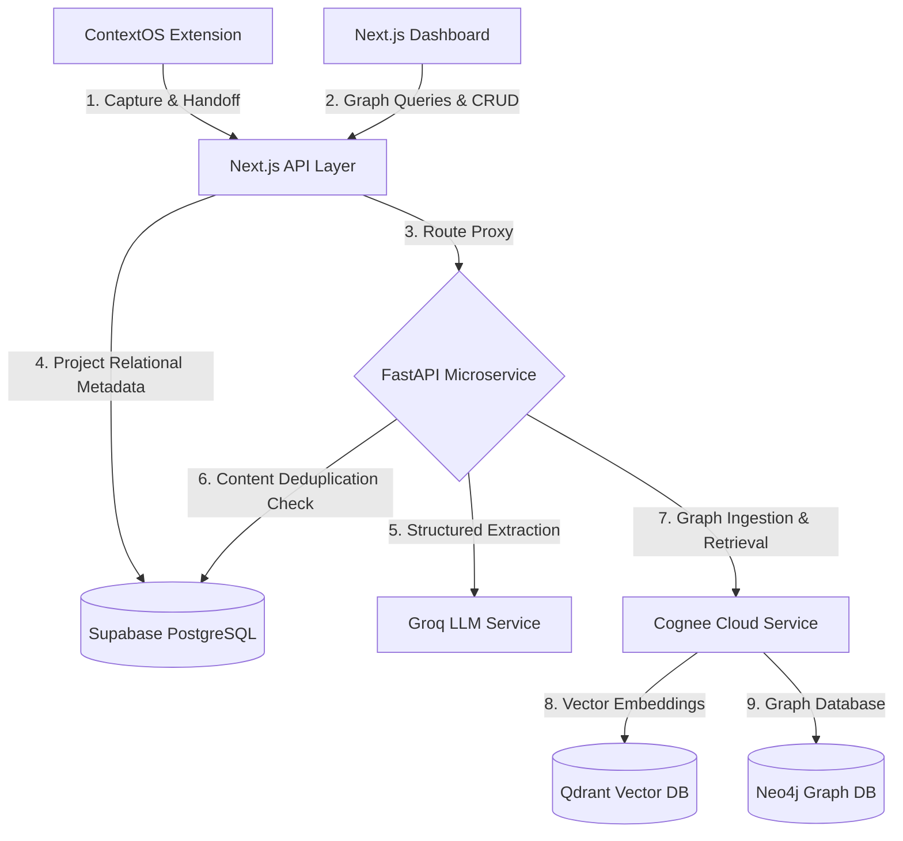
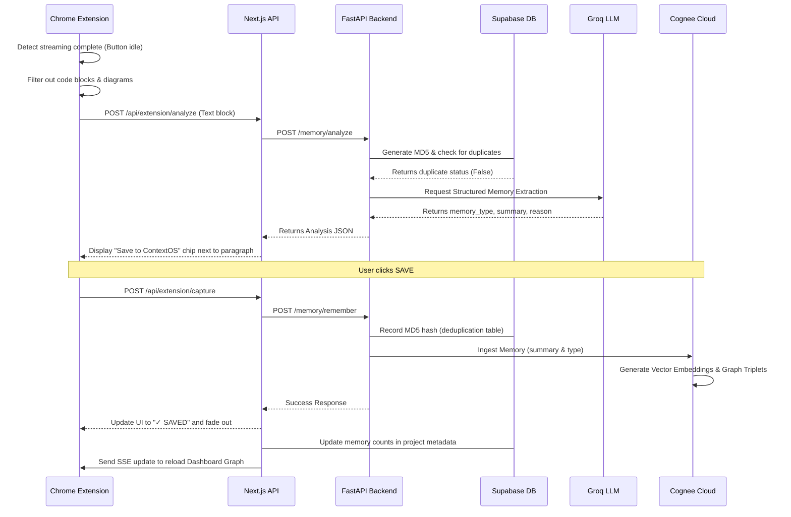
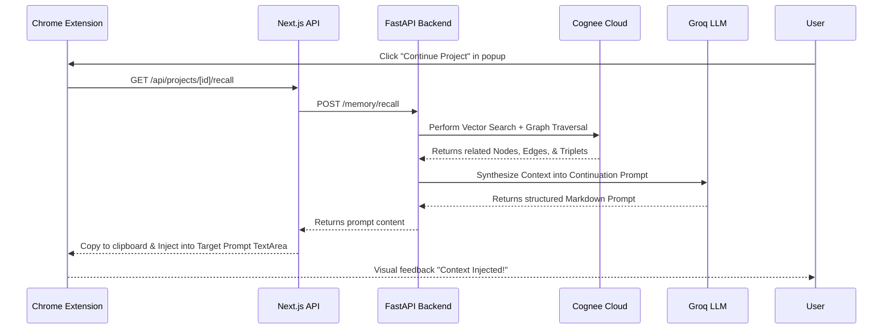

# Architecture Specification: ContextOS

ContextOS is designed as a hybrid, multi-layered ambient intelligence platform that captures user decisions during AI-assisted programming and structures them into a queryable, persistent Knowledge Graph.

---

## 1. High-Level System Architecture

ContextOS operates with a client-server-orchestrator layout split across three primary physical runtimes:

1. **Client Space (Roamer)**: The Chrome extension running on user browser sessions (ChatGPT, Claude, etc.) captures text blocks and handles state injections.
2. **Dashboard Space (Visualizer)**: A Next.js 16 Web Application providing 3D spatial visualization and project settings.
3. **Orchestrator Backend (Synthesizer)**: A Python FastAPI microservice that processes raw text, deduplicates content, performs entity extraction using Groq LLM, and manages the graph logic inside Cognee.

---

## 2. Component Directory & Responsibilities

### A. Chrome Extension (Capture Engine)
- **Role**: Ambient DOM listener.
- **Implementation**: Vanilla JS Content Script, Event-Driven Message passing.
- **Key Flow**: 
  - Tracks ChatGPT's submit button state.
  - Detects the transition from `generating` to `idle` (stream completion).
  - Isolates the latest assistant message, filters code blocks and diagrams, and dispatches the text block for parallel analysis.
  - Renders absolute-positioned overlay toolbars aligned with target paragraphs using parent relative positioning.

### B. Next.js API Gateway & Dashboard
- **Role**: API router, database manager, and 3D Visualizer.
- **Implementation**: Next.js App Router (TypeScript), Tailwind CSS, Three.js (React Three Fiber).
- **Key Flow**: 
  - Stores project settings, tokens, and active session configurations in Supabase.
  - Proxies analytical and capture queries to the Python FastAPI microservice.
  - Subscribes to database changes to broadcast real-time events to the 3D Graph panel.

### C. Python FastAPI Service (Orchestration Engine)
- **Role**: High-performance semantic handler.
- **Implementation**: Python 3.11, FastAPI, Pydantic v2.
- **Key Flow**:
  - Receives capture requests.
  - Generates MD5 content hashes of text blocks and validates them against the Supabase deduplication table.
  - Routes raw text to Groq LLM for entity and relationship extraction.
  - Feeds structured nodes and relationships into Cognee Cloud to form graph triplets.

---

## 3. Data Pipelines

### A. Memory Capture Pipeline
This pipeline describes the lifecycle of an ambient text capture when the AI assistant finishes generating a response.

---

## 4. Recall and Handoff Pipeline
This pipeline describes how ContextOS retrieves project history from the Graph and structures it into a Continuation Prompt.

